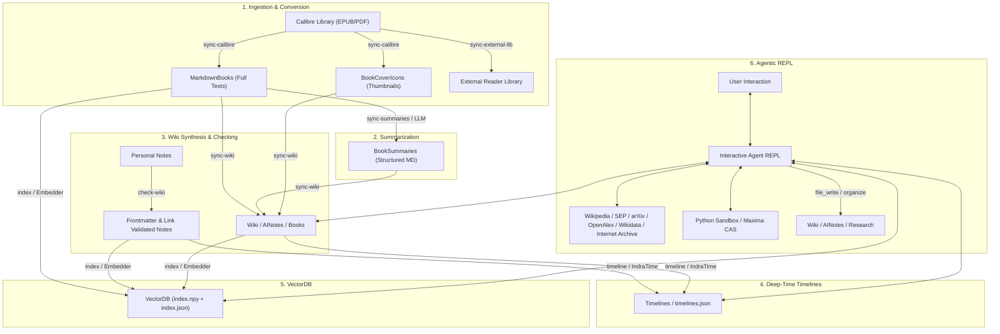

# knrs — Knowledge Retrieval & Synthesis

[](https://www.python.org/downloads/)
[](https://github.com/astral-sh/uv)
[](LICENSE)

> [!WARNING]
> This project is under active development. Everything is subject to change at any time.

**knrs** is a local-first, LLM-enabled knowledge-base wiki system. It synthesizes personal ebook libraries (Calibre), markdown notes, deep-time timelines, differential vector databases, and modular local/remote LLM backends into an interconnected, searchable personal research wiki driven by an interactive, tool-augmented research agent.

---

## Table of Contents

- [Overview & Architecture](#overview--architecture)
- [Key Features](#key-features)
  - [1. Calibre Library Synchronization](#1-calibre-library-synchronization)
  - [2. AI Summarization Pipeline](#2-ai-summarization-pipeline)
  - [3. Wiki & Notes Synthesis](#3-wiki--notes-synthesis)
  - [4. Deep-Time Timeline Engine (IndraTime)](#4-deep-time-timeline-engine-indratime)
  - [5. Differential VectorDB & Semantic Search](#5-differential-vectordb--semantic-search)
  - [6. Agentic REPL & Research Assistant](#6-agentic-repl--research-assistant)
  - [7. Benchmark Framework & Web Visualizer](#7-benchmark-framework--web-visualizer)
  - [8. Git & Syncthing Synchronization Safety](#8-git--syncthing-synchronization-safety)
- [Subprocess Backend Architecture](#subprocess-backend-architecture)
- [Prerequisites & Dependencies](#prerequisites--dependencies)
- [Installation & Setup](#installation--setup)
- [Configuration](#configuration)
- [CLI Reference](#cli-reference)
- [Interactive REPL & Slash Commands](#interactive-repl--slash-commands)
- [Agent Tool Reference](#agent-tool-reference)
- [Repository Structure](#repository-structure)
- [Authors & AI Collaboration](#authors--ai-collaboration)

---

## Overview & Architecture

`knrs` bridges the gap between static document storage, personal note-taking (Obsidian / Foam / standard Markdown), semantic retrieval, and agentic LLM exploration. It operates in structured pipelines that transform raw literature into linked knowledge:



---

## Key Features

### 1. Calibre Library Synchronization
- **Two-phase differential sync**: Scans Calibre library metadata (`metadata.db` / `.opf`) and existing markdown files. Computes a plan (`ADD`, `REMOVE`, `RECONVERT`, `RENAME`, `MOVE`, `UPDATE_METADATA`) before execution.
- **Robust conversion**: Converts EPUBs via Pandoc and PDFs via pdftotext/OCR (with Apple Vision `macocr` acceleration on macOS) into clean Markdown with YAML frontmatter.
- **Collision detection**: Enforces deterministic, filesystem-safe filenames (capped at 80 characters, preserving volume/edition suffixes) and detects title collisions across the library before writing.
- **Cover thumbnail extraction**: Generates optimized JPEG thumbnails for all ingested books.

### 2. AI Summarization Pipeline
- **Differential change detection**: Computes SHA-256 hashes of markdown bodies (`source_md_hash`) to avoid regenerating summaries unless source texts change.
- **Modular summarizer engines**: Summarizes large books chunk-by-chunk using local hardware-accelerated backends or cloud endpoints.
- **Automatic VRAM management**: Automatically frees and unloads model weights upon task completion.

### 3. Wiki & Notes Synthesis
- **Composite book pages**: Assembles unified markdown pages in `Wiki/AINotes/Books/` featuring YAML metadata, cover art embeds, Calibre URI links, and generated summaries.
- **Frontmatter injection & validation**: Injects UUIDs, context directories, and git/filesystem creation dates into user notes (`inject_frontmatter_in_notes` and `check-wiki`).
- **Wikilink integrity checker**: Validates `[[Wikilinks]]` across the entire wiki tree, flags ambiguous duplicate file stems, reports broken/malformed links, and can optionally convert broken links into italic text.
- **LLM-guided taxonomy organizer**: Evaluates document topics using an LLM classifier and restructures `AINotes/Research/` into logical directory hierarchies while migrating associated images and resources.

### 4. Deep-Time Timeline Engine (IndraTime)
- **Universal time format**: Custom `IndraTime` parser supporting:
  - Astronomical historical dates: `YYYY`, `YYYY-MM`, `YYYY-MM-DD`, `BC / BCE` (1 BC = 0.0, 2 BC = -1.0, etc.)
  - Deep-time & archaeological scales: `BP` (Before Present, 1950), `kya / ka` (thousand years ago), `Ma / mya` (million years ago), `Ga / bya` (billion years ago).
- **Markdown table extraction**: Scans markdown files for tables containing `Date` and `Event` / context columns, validates date intervals (detecting ordering errors and inverted intervals), and indexes them into `timelines.json`.
- **Querying & filtering**: Filter events by date range, context, and keywords with formatted terminal tables or raw markdown output.

### 5. Differential VectorDB & Semantic Search
- **Sliding-window chunking**: Configurable character chunk sizes and overlaps (default: 3000 chars with 600 chars overlap).
- **Crash-safe checkpointing**: Indexes `MarkdownBooks` and `Wiki/`, persisting incremental checkpoints to disk every $N$ files or $M$ chunks.
- **Context-aware retrieval**: Expands search result snippets to natural sentence/paragraph boundaries with line number tracking.
- **Relevance heatmap highlighting**: Highlights high-significance passages within returned chunks by computing character-level cosine similarities against the query embedding.
- **AI search synthesis**: Directly synthesize search results into a unified summary citing source titles and authors (`--summarize`).

### 6. Agentic REPL & Research Assistant
- **Multi-turn conversational research**: A fully autonomous research agent capable of iteratively exploring local and external sources, running computations, drafting notes, and organizing research.
- **Local knowledge base tools**: Search the vector index, read files by line range, list directories, query timelines, and resolve wikilink targets.
- **Safe wiki authoring**: Strictly sandboxed writing to `AINotes/Research/` with automatic stem uniqueness enforcement across the wiki tree.
- **External research integrations**: Query Wikipedia, Stanford Encyclopedia of Philosophy (SEP), arXiv (with OpenAlex fallback), OpenAlex, Wikidata, and the Internet Archive.
- **Integrated computation & symbolic math**:
  - `python_eval`: Executes code in an isolated virtual environment preloaded with NumPy, SciPy, SymPy, Pandas, and Matplotlib.
  - `maxima_eval`: Evaluates symbolic algebra, calculus, and mathematical expressions using the Maxima Computer Algebra System.
- **Session persistence**: Save and restore complete conversational checkpoints via `/save-session` and `/load-session`.

### 7. Benchmark Framework & Web Visualizer
- **Automated test suite**: Benchmarks load times, generation latency, throughput (tokens/sec, chunks/sec, pages/sec), and soft-refusal heuristics across converter, summarizer, embedder, and agent backends.
- **Multi-host history**: Aggregates benchmark runs per hostname with exponential moving average tracking.
- **Interactive web dashboard**: Run `knrs benchmark --visualize` to launch a browser-based dashboard visualizing backend throughput and latency comparisons.

### 8. Git & Syncthing Synchronization Safety
- **Git safety gates**: Automatically verifies that `knrs_data` and `wiki_path` repositories have clean working trees and match upstream remotes before running state-altering commands.
- **Automated AI git commits**: Auto-syncs git repositories (`/sync-git`), generating concise, descriptive commit messages from cached diffs using local LLMs.
- **Syncthing awareness**: Monitors Syncthing folder status and pending sync byte counts to prevent write collisions across devices.

---

## Subprocess Backend Architecture

`knrs` decouples heavy machine-learning dependencies and runtime environments using isolated subprocesses that communicate via a structured JSON protocol over stdin/stdout.

```
subprocesses/
├── md_converter/             # Document conversion (Pandoc, OCR, Apple Vision macocr)
├── agent_core/               # Base protocol, tool definitions & registry
├── agent_api/                # Agent backend for OpenAI-compatible / llama.cpp / vLLM / Ollama APIs
├── agent_hf/                 # Agent backend using local Hugging Face Transformers
├── agent_macos/              # Agent backend optimized for Apple Silicon (MLX / Metal)
├── embedder_api/             # Embedding backend for OpenAI / llama-server embedding APIs
├── embedder_hf/              # Embedding backend using local Hugging Face sentence-transformers
├── summarizer_core/          # Summarization protocols and prompts
├── summarizer_api/           # Summarization backend for OpenAI-compatible endpoints
├── summarizer_gc_gemma4_31b/ # Google Cloud Gemma vertex/endpoint summarizer
├── summarizer_macos/         # Apple Silicon MLX summarizer
└── summarizer_linux/         # PyTorch / CUDA / ROCm / Intel XPU summarizer
```

---

## Prerequisites & Dependencies

### Required
- **Python >= 3.13**
- **[uv](https://github.com/astral-sh/uv)** (Fast Python package manager)

### Optional External Binaries
- **[Pandoc](https://pandoc.org/)**: Required for EPUB-to-Markdown book conversion.
- **[Maxima](https://maxima.sourceforge.io/)**: Required for CAS symbolic mathematics (`maxima_eval` tool).
- **[Git](https://git-scm.com/)**: Required for git safety checks and automated `/sync-git` repository commits.

On macOS (Homebrew):
```bash
brew install uv pandoc maxima git
```

On Ubuntu / Debian:
```bash
sudo apt update && sudo apt install -y pandoc maxima git
curl -LsSf https://astral.sh/uv/install.sh | sh
```

---

## Installation & Setup

1. **Clone the repository**:
   ```bash
   git clone https://github.com/domschl/knrs.git
   cd knrs
   ```

2. **Sync root dependencies and initialize backends**:
   ```bash
   python3 install.py
   ```

   *Flags for specific hardware/environments:*
   - `--offline`: Run `uv sync` without network access using local cache.
   - `--xpu`: Install Intel XPU-optimized PyTorch/Torchvision builds.

---

## Configuration

`knrs` stores its configuration in `~/.config/knrs/knrs.json`.

### Minimal Configuration Example
Create `~/.config/knrs/knrs.json`:

```json
{
  "calibre_path": "~/Calibre Library",
  "notes_path": "~/Wiki/Notes",
  "knrs_data": "~/KnrsData",
  "wiki_path": "~/Wiki",
  "vector_db_path": "~/KnrsData/VectorDB"
}
```

### Full Configuration Reference

| Key | Type | Default | Description |
|---|---|---|---|
| `calibre_path` | `string` | *(Required)* | Path to the root of your Calibre library directory. |
| `notes_path` | `string` | *(Required)* | Path to human-authored notes inside your wiki. |
| `knrs_data` | `string` | *(Required)* | Storage root for converted books, summaries, cover icons, and timelines. |
| `wiki_path` | `string` | *(Required)* | Root directory of your markdown wiki. |
| `vector_db_path` | `string` | *(Required)* | Directory where `index.npy` and `index.json` will be stored. |
| `target_series` | `list[string]` | `[]` | Limit Calibre sync and summarization to specific series (empty = all). |
| `auto_git_sync` | `bool` | `true` | Automatically commit and sync git repos during `/sync` and on startup. |
| `summarizer_name` | `string` | `"summarizer_linux"` | Active summarizer backend (`summarizer_api`, `summarizer_macos`, etc.). |
| `embedder_name` | `string` | `"embedder_hf"` | Active embedding backend (`embedder_hf`, `embedder_api`). |
| `agent_backend_name` | `string` | `"agent_api"` | Active agent LLM backend (`agent_api`, `agent_macos`, `agent_hf`). |
| `calibre_library_name`| `string` | `"Calibre_Library"` | Name of Calibre library used when constructing `calibre://` URIs. |
| `external_library` | `string` | `"~/MetaLibrary"` | Target directory for `/sync-external-lib`. |
| `benchmark_path` | `string` | `"~/.config/knrs/benchmarks"` | Directory storing historical benchmark JSON files. |
| `vector_chunk_size` | `int` | `3000` | Sliding window chunk size in characters (~750 tokens). |
| `vector_chunk_overlap`| `int` | `600` | Overlap between adjacent vector chunks in characters. |
| `checkpoint_every_docs`| `int` | `50` | Write vector index checkpoint every $N$ files. |
| `checkpoint_every_chunks`| `int`| `5000` | Write vector index checkpoint every $M$ chunks. |
| `enable_python_eval` | `bool` | `true` | Enable/disable the `python_eval` code sandbox in the research agent. |

---

## CLI Reference

Run `knrs` commands via `uv run knrs <command>`:

```bash
# Start the interactive REPL (default)
uv run knrs

# Print the resolved configuration
uv run knrs config

# Run the complete end-to-end sync pipeline
uv run knrs sync [--dry-run] [--force]

# Sync Calibre books to MarkdownBooks
uv run knrs sync-calibre [--dry-run] [--force] [--concurrency N]

# Generate AI summaries for converted books
uv run knrs sync-summaries [--dry-run] [--force] [--concurrency N]

# Sync KnrsData books and summaries to Wiki/AINotes
uv run knrs sync-wiki [--force]

# Extract and filter timelines from markdown notes
uv run knrs timeline [--from YYYY] [--to YYYY] [--context TAG] [--raw] [keywords...]

# Update or rebuild the differential VectorDB index
uv run knrs index [--force] [--checkpoint-every-docs N] [--checkpoint-every-chunks M]

# Perform semantic search directly from the CLI
uv run knrs search "quantum computing decoherence" [--raw] [--highlight]

# Run backend benchmarks
uv run knrs benchmark [--type summarizer|embedder|agent|converter] [--backend NAME]

# Launch the benchmark visualization web dashboard
uv run knrs benchmark --visualize
```

*Note: Any REPL slash command can also be run directly as a one-shot CLI command (e.g. `uv run knrs /check-wiki --dry-run`).*

---

## Interactive REPL & Slash Commands

Launch the interactive REPL with `uv run knrs`. You can chat directly with the research agent or execute slash commands for system maintenance:

| Command | Arguments | Description |
|---|---|---|
| `/help` | — | Display help and list all available commands. |
| `/sync` | `[--force] [--dry-run]` | Execute full pipeline: Calibre $\to$ Summaries $\to$ Wiki $\to$ Check $\to$ Timeline $\to$ Index $\to$ ExtLib $\to$ Git. |
| `/sync-git` | `[commit-message]` | Stage, commit, pull, and push changes in Wiki and Data git repositories. |
| `/sync-calibre`| `[--dry-run] [--force]` | Convert and sync Calibre library to `MarkdownBooks`. |
| `/sync-summaries`| `[--dry-run] [--force]` | Generate summaries for new/modified `MarkdownBooks`. |
| `/sync-wiki` | `[--force]` | Assemble composite pages in `Wiki/AINotes/Books/`. |
| `/sync-external-lib`| `[--dry-run]` | Synchronize EPUB/PDF files to external reader folder. |
| `/check-wiki` | `[--dry-run] [--broken-links-to-italics] [--force]` | Check metadata, duplicate names, and broken wikilinks. |
| `/organize` | `[--dry-run] [--force]` | Restructure `AINotes/Research/` hierarchically using LLM taxonomy. |
| `/timeline` | `[--from Y] [--to Y] [--context C] [--raw] [kw]` | Query deep-time timeline database. |
| `/index` | `[--force] [--checkpoint-every-docs N]` | Incrementally update or rebuild VectorDB embeddings. |
| `/search` | `<query> [--raw] [--highlight] [--summarize]` | Perform semantic search and optionally summarize with AI. |
| `/research-list`| — | Display tree view of past research files in `AINotes/Research/`. |
| `/save-session`| `[name]` | Save conversation history to a JSON checkpoint. |
| `/load-session`| `[name]` | Restore a saved conversation session. |
| `/reset` | — | Clear conversational context and start a new session. |
| `/backends` | — | List all discovered subprocess backends and their active states. |
| `/models` | `<backend_name>` | List available and validated models for a backend. |
| `/set-backend`| `<type> <backend_name>` | Switch active backend (e.g. `/set-backend summarizer summarizer_api`). |
| `/set-param` | `<backend\|global\|llm-server> <key> <val>` | Update runtime parameters in configuration. |
| `/sync-status`| — | Inspect live Syncthing synchronization status across folders. |
| `/config` | — | Print active runtime configuration. |
| `/exit` | — | Exit the REPL. |

---

## Agent Tool Reference

The research agent has access to a comprehensive suite of local and external tools:

### Local Knowledge & Wiki Tools
- `vector_search(query, top_k=5)`: Semantic search over indexed books, summaries, and notes.
- `file_read(path, start_line=1, end_line=-1)`: Read content from books or notes with line-range controls.
- `file_list(directory)`: List files and directories within allowed wiki roots.
- `wikilink_search(query)`: Find existing wiki pages matching a target stem to use in `[[wikilinks]]`.
- `file_write(path, content)`: Create a research note in `AINotes/Research/` (enforces unique filenames).
- `file_append(path, content)`: Append content to an existing research note.
- `create_directory(path)`: Create a directory inside `AINotes/Research/`.
- `file_move(src, dst)`: Move or rename files within `AINotes/Research/`.
- `check_wiki()`: Validate metadata frontmatter across all research notes.
- `update_index()`: Run differential vector indexing on newly created notes.
- `organize_research(dry_run=False)`: Classify and organize research notes into subfolders.

### Deep-Time Timeline Tools
- `timeline_query(start_year, end_year, context_filters, keywords)`: Query the timeline database.
- `extract_timeline(path)`: Extract timeline tables from a research note and merge into `timelines.json`.

### Academic & Web Research Tools
- `wikipedia_search(query)` / `wikipedia_fetch(title)`: Search and download Wikipedia articles to `Cache/Wikipedia/`.
- `sep_search(query)` / `sep_fetch(entry)`: Search and fetch Stanford Encyclopedia of Philosophy entries to `Cache/SEP/`.
- `arxiv_search(query, max_results=5)` / `arxiv_fetch(arxiv_id)`: Search and fetch arXiv papers/abstracts (with OpenAlex fallback) to `Cache/arXiv/`.
- `openalex_search(query, max_results=5)`: Search peer-reviewed academic works via OpenAlex.
- `wikidata_search(query)` / `wikidata_entity(entity_id)`: Search Wikidata and inspect structured entity properties (Q-identifiers).
- `archive_search(query)` / `archive_fetch(identifier)`: Search and retrieve historical texts from the Internet Archive.

### Computation & Symbolic Mathematics
- `python_eval(code)`: Execute Python code in an isolated virtual environment containing NumPy, SciPy, SymPy, Pandas, and Matplotlib.
- `maxima_eval(expression)`: Evaluate symbolic mathematics and calculus expressions via Maxima CAS.

---

## Repository Structure

```
knrs/
├── agent/                    # Research agent engine, prompts, context & tool dispatch
│   ├── agent.py              # Multi-turn conversational agent loop
│   ├── context.py            # Conversation history, session save/load & trimming
│   ├── engine.py             # AgentSession backend client
│   ├── prompts.py            # System prompts and behavior definitions
│   └── tools.py              # Agent tool implementations
├── benchmark/                # Performance benchmark harness & visualizer
│   ├── runner.py             # Test runner, latency/throughput & verification
│   ├── sample_docs.py        # Synthetic test document generators (MD, EPUB, PDF)
│   ├── system_info.py        # Hardware and OS profiler
│   └── visualizer.html       # Web dashboard for benchmark analytics
├── calibre/                  # Calibre integration & conversion pipeline
│   ├── converter.py          # EPUB/PDF to Markdown conversion & frontmatter
│   ├── cover.py              # Thumbnail generation
│   ├── library.py            # Calibre database and OPF parser
│   └── sync.py               # Calibre -> MarkdownBooks orchestrator
├── external_lib/             # External library synchronization
│   └── sync.py               # EPUB/PDF synchronization to MetaLibrary
├── repl/                     # Interactive REPL interface
│   ├── backends.py           # Subprocess backend discovery & management
│   ├── commands.py           # Slash-command dispatcher
│   └── repl.py               # Prompt-toolkit REPL loop
├── subprocesses/             # Hardware-isolated backend microservices
│   ├── agent_api/            # Agent OpenAI-compatible / llama.cpp backend
│   ├── agent_core/           # Tool schemas and base JSON protocol
│   ├── agent_hf/             # Agent Hugging Face Transformers backend
│   ├── agent_macos/          # Agent Apple Silicon MLX backend
│   ├── embedder_api/         # Embedding OpenAI-compatible backend
│   ├── embedder_hf/          # Embedding Hugging Face sentence-transformers backend
│   ├── md_converter/         # Document conversion (Pandoc, OCR, macocr)
│   ├── summarizer_api/       # Summarizer API backend
│   ├── summarizer_core/      # Summarizer base protocols
│   ├── summarizer_gc_gemma4_31b/ # Google Cloud Gemma summarizer backend
│   ├── summarizer_linux/     # PyTorch / CUDA / XPU summarizer backend
│   └── summarizer_macos/     # Apple Silicon MLX summarizer backend
├── summarizer/               # Book summarization pipeline
│   ├── engine.py             # SummarizerSession backend client
│   └── sync.py               # MarkdownBooks -> BookSummaries orchestrator
├── timelines/                # Deep-time timeline system
│   ├── extractor.py          # Table extractor, timeline querying & rendering
│   └── indra_time.py         # IndraTime deep-time parser & formatter
├── utils/                    # Shared utilities
│   ├── search.py             # Search filters and keyword matching
│   └── syncthing.py          # Syncthing API status monitor
├── vector/                   # VectorDB and semantic search
│   ├── engine.py             # EmbedderSession backend client
│   ├── indexer.py            # Differential chunk-and-embed indexer
│   └── search.py             # Cosine search, context expansion & significance heatmap
├── wiki/                     # Wiki synchronization & consistency checkers
│   ├── assembler.py          # Composite wiki page generator
│   ├── checker.py            # Link checker, UUID injector & duplicate detector
│   ├── organizer.py          # LLM-guided directory taxonomy reorganizer
│   └── sync.py               # KnrsData -> Wiki/AINotes orchestrator
├── config.py                 # Configuration loader and dataclass schema
├── install.py                # Installation and multi-backend sync script
├── knrs.py                   # Main CLI entrypoint
├── logging_setup.py          # Rich logging configuration
├── naming.py                 # Safe filename generation and collision checks
├── paths.py                  # Path resolution and git safety checks
└── pyproject.toml            # Project package configuration
```

---

## Authors & AI Collaboration

This repository is developed by **domschl** in collaboration with **Antigravity** (an AI coding assistant designed by Google DeepMind), who serves as a primary author of the agentic frameworks, codebase restructuring, and integration layers.
